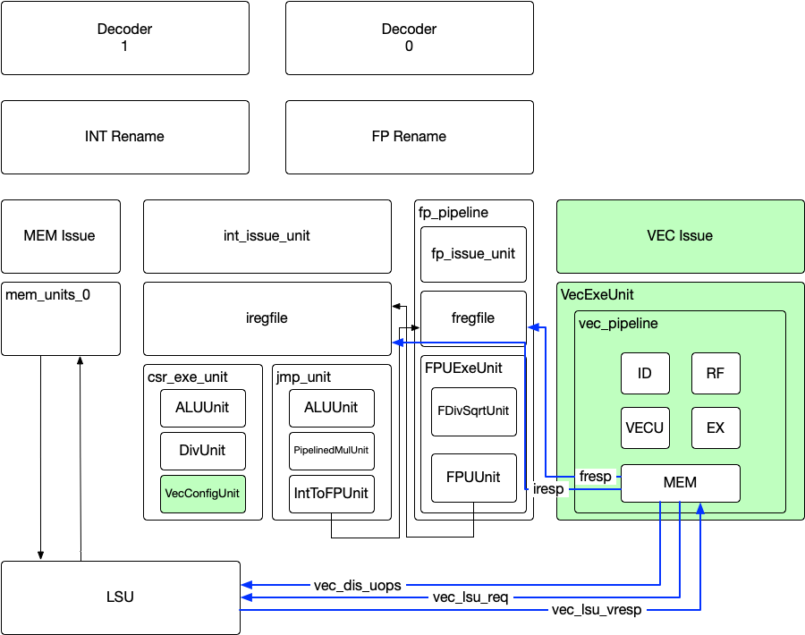
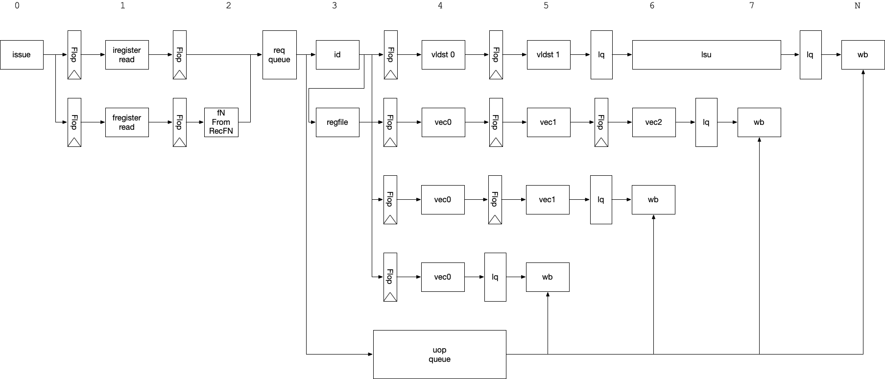
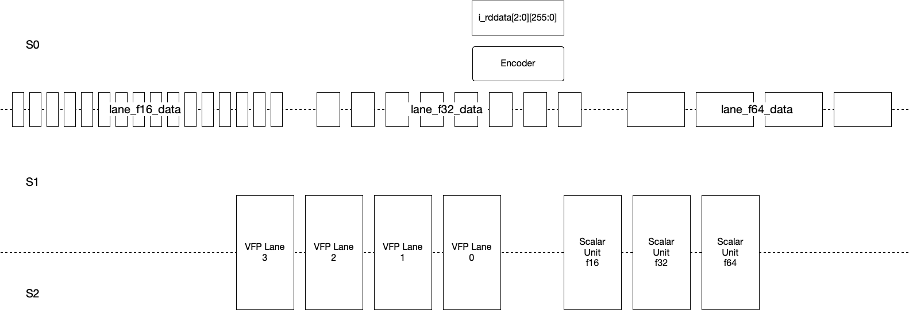
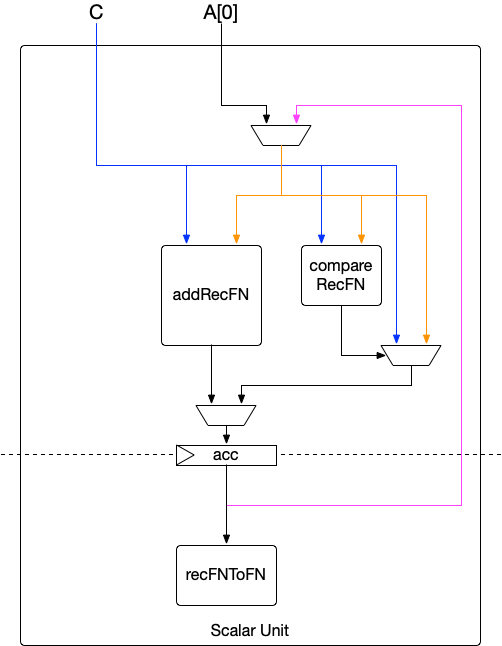

# Vector Extension

## Overview
The added Risc-V Vector (RVV) Unit is based on ratified [Vector Extension 1.0 specification](https://github.com/riscv/riscv-v-spec/releases/tag/v1.0)



The RVV unit is an in-order pipeline without register renaming support.
And it doesn't support speculative execution nor flush.
In order to integrate it with out-of-order Boom core, vector instructions (except vset) are stalled until all speculations are resolve, such as unresolved branches.

Vector Load/Store instructions gets cracked into piece, one per element.

A set of LDQ entries are dedicated for Vector Loads.

Vector store instructions share the same STQ allocation mechanism as scalar stores.
Each vector store instruction gets allocated with one STQ entry.
And it gets released after all the elements of this store instruction transmitted the store requests.

## Limitation & Known issues
1. Doesn't support division, reciprocal, and square root instructions, including
`vdiv, vdivu, vfsqrt, vfsqrt7, vfrec7, vfdiv, vfrdiv, vremu, vrem`
2. The integer unit only supports rounding mode of vxrm==0 (round-to-nearest-up)
3. Doesn't support exceptions on vector instruction.
4. Ordered segment Load/Store are executed in field-major order instead of element-major order required by the spec.

## Enabling Vector Unit
Vector Unit can be enabled by adding the following line in config-mixins:
new boom.common.WithVector(issueWidth) ++

For example,
```
class MediumBoomVecConfig extends Config(
  new boom.common.WithVector(2) ++                               // Add vector
  new boom.common.WithNMediumBooms(1) ++                         // medium boom config
  new chipyard.config.AbstractConfig)
```

## Parametrization
The default VLEN is set to 256b.
It can be changed by updating the config-mixins.scala and tt_briscv_pkg.vh
For example,
```
--- a/src/main/resources/vsrc/rvv/tt_briscv_pkg.vh
+++ b/src/main/resources/vsrc/rvv/tt_briscv_pkg.vh
@@ -17,7 +17,7 @@ package tt_briscv_pkg;

 localparam ACTUAL_LQ_DEPTH = 8;

-localparam VLEN=256;
+localparam VLEN=128;
```

```
--- a/src/main/scala/common/config-mixins.scala
+++ b/src/main/scala/common/config-mixins.scala
@@ -94,7 +94,7 @@ class WithVector(coreWidth: Int = 1) extends Config((site, here, up) => {
     case tp: BoomTileAttachParams => tp.copy(tileParams = tp.tileParams.copy(core = tp.tileParams.core.copy(
       enableVector = true,
       enableFastLoadUse = false, // Vector Unit doesn't support replay
-      setvLen = 256,
+      setvLen = 128,
```

## Micro-Architecture
### Vector Pipeline

### Vector Floating-Point Unit

### Vector Floating-Point Encoder

### Vector Floating-Point Encoder Lane

### Vector Floating-Point Lane

### Vector Floating-Point Execution Unit

### Vector Floating-Point Scalar Unit



